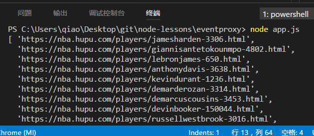

# 简单爬虫以及控制并发

## 目标
爬取[虎扑球员数据](https://nba.hupu.com/stats/players/pts),每个球员的场均得分和薪酬。
调用node app.js时，将以上数据以json格式输出。

## 模块
主要用到以下几个模块

1. [eventproxy](https://github.com/JacksonTian/eventproxy)
    
1. [superagent](http://visionmedia.github.io/superagent/)

1. [cheerio](https://github.com/cheeriojs/cheerio) 
    社区翻译版：[中文api](https://cnodejs.org/topic/5203a71844e76d216a727d2e)

## 简单爬虫
执行后如图：